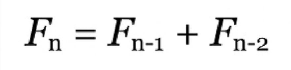
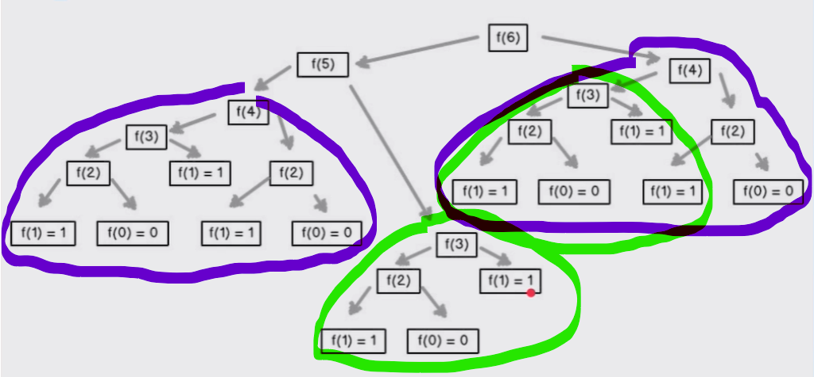

<div align="center">
  <h1>Programación Dinámica y Estocástica</h1>
  <p>Apuntes Basados en el <a href="https://platzi.com/clases/programacion-estocastica/">Curso de Programación Dinámica y Estocástica con Python</a> de Platzi</p>
</div>

<div align="center"> 
  
</div>

# Tabla de contenido
- [Objetivos](#Objetivos)
- [Introducción a la Programación Dinámica](#introducción-a-la-programación-dinámica)
  - [Memoization](#Memoization)


# Objetivos
- Aprender cuándo utilizar Programación Dinámica y sus beneficios.
- Entender la diferencia entre programas deterministas y estocásticos.
- Aprender a utilizar Programación Estocástica.
- Aprender a crear simulaciones computacionales válidas.

# Introducción a la Programación Dinámica

Es uno de los conceptos más difíciles de entender dentro del mundo de las ciencias de la computación, no porque sus técnicas o los problemas que trata de resolver sean difíciles, sino porque en realidad el nombre no tiene nade que ver con la técnica que esta detrás.

<div align="center"> 
  
  <p>Dr. Richard Bellman</p>
</div>


Todo comenzo con el Dr. Bellman quería elegir un término que no sonara a investigación matemática para que el gobierno patrocinara sus investigaciones. El Secretario de Defensa fue parcial contra la investigación. Tampoco quería un término que pudiera usarse en un sentido peyorativo (despectivo).

Entonces escogió "programación", que sonaba menos como investigación matemática. También quería transmitir la idea de que era de varias etapas, por lo que eligió "dinámico". Esto también fue difícil de usar de manera negativa.

El término fue acuñado para que nadie se opusiera y el Dr. Bellman continuaría su trabajo.

Habiendo aclarado porque tiene este nombre lo que hay que saber de la programación dinámica es que es una de las técnicas más poderosas dentro del mundo del computer science para poder optimizar ciertos tipos de problemas. 

Los problemas que puede optimizar son aquellos que tienen una subestructura óptima. La subestructura óptima significa que la solución óptima global se pede encontrar encontrando soluciones óptimas a problemas locales. Se trata de generar a partir de un problema principal problemas más pequeños y una vez encontrando una solución para estos problemas más pequeños poder resolver de forma óptima el problema principal.

Para que la programación dinámica pueda realmente optimizar nuestro problema también tienen que haber problemas empalmados.  Por ejemplo, cuando utilizamos algoritmos recursivos.

- _Subestructura Óptima_. Una solución global óptima se puede encontrar al combinar soluciones óptimas de subproblemas locales. 

- _Problemas empalmados_. Una solución óptima que involucra resolver el mismo problema en varias ocasiones.

## Memoization 

- La Memorización es una técnica para guardar cómputos previos y evitar realizarlos nuevamente. 
- Normalmente se utiliza un diccionario, donde las consultas se pueden hacer en O(1) _de forma lineal_.
- Intercambia tiempo por espacio. 

## Números de Fibonacci

<div align="center"> 
  
  </br>
</div>
Los números de Fibonacci tienen propiedades computacionales muy interesantes que nos permiten entender conceptos de alto nivel. La definición recursiva _fn = fn-1 + fn-2_ es muy fácil de implementar en código pero es muy ineficiente porque crece de forma exponencial.

<div align="center">
  </br>
  
  <p>Se repiten operaciones de forma ineficiente </p>
</div>

Si optimizamos el método recursivo de Fibonacci implementando la técnica de Memoization a nuestro código podemos obtener mejoras sorprendentes.

### Implementación del cálculo de números Fibonacci de forma recursiva sin optimizar.
```
def fibonacci_recursivo(n):
    if n == 0 or n == 1: 
        return 1 
    
    return fibonacci_recursivo(n - 1) + fibonacci_recursivo(n - 2)
    
```
Esta implementación solo nos sirve para números pequeños 

### Implementación del cálculo de números Fibonacci optimizado con Memoization.
```
def fibonacci_dinamico(n, memo = {}):
    if n == 0 or n == 1: 
        return 1 
    
    try:
        return memo[n]
    except KeyError:
        resultado = fibonacci_dinamico(n - 1, memo) + fibonacci_dinamico(n - 2, memo)
        memo[n] = resultado

        return resultado
```
Como podemos ver, añadiendo un diccionario al método donde se van almacenando los resultados que cada número requerido para el cálculo logramos crear un código más eficiente intercambiando computo por memoria. Esto es solo efectivo en problemas empalmados.


